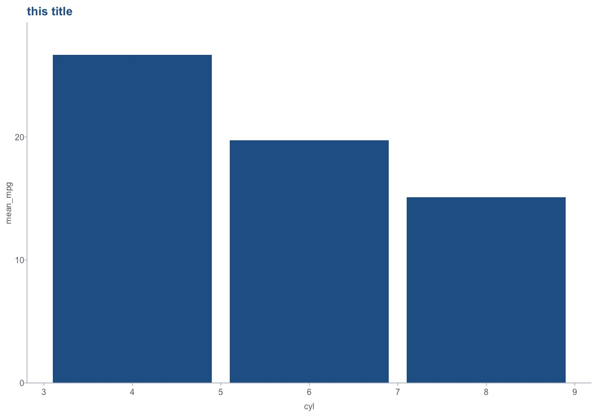

# Overview

`cplthemes` is an R package to construct visualizations in accordance with CPL's style guide. Currently, the package supports basic `ggplot` visualizations. The package is inspired by the excellent Urban Institute's [`urbnthemes`](https://github.com/UrbanInstitute/urbnthemes) package.

# Installation

```
install.packages("devtools")
devtools::install_github("lmgibson/cplthemes")
```

# Usage

```r
library(tidyverse)
library(cplthemes)

cpl_set_theme()

mtcars %>%
    group_by(cyl) %>%
    summarize(mean_mpg = mean(mpg)) %>%
    ggplot(mapping = aes(x = cyl, y = mean_mpg)) +
    geom_col() +
    scale_y_continuous(expand = expand_scale(mult = c(0,0.1))) +
    labs(title = "this title")
```


