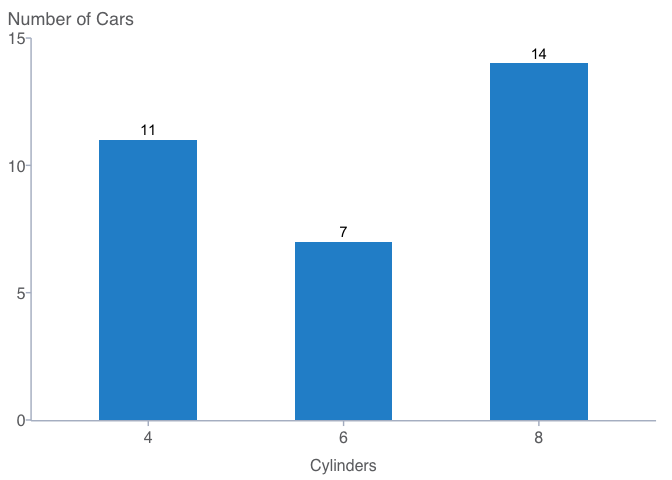

README
================

# Overview

`cplthemes` is an R package to construct visualizations in accordance
with CPL’s style guide. Currently, the package supports basic `ggplot`
visualizations. The package is inspired by the excellent Urban
Institute’s [`urbnthemes`](https://github.com/UrbanInstitute/urbnthemes)
package.

# Installation

    install.packages("devtools")
    devtools::install_github("californiapolicylab/cplthemes")

# Usage

For detailed usage see the [CPL design guide
documentation](https://californiapolicylab.github.io/cpl_design_guide/).

``` r
library(tidyverse)
library(cplthemes)

cpl_set_theme()

mtcars %>%
  count(cyl) %>%
  ggplot(mapping = aes(x = factor(cyl), y = n)) +
  geom_col(width = 0.5) +
  geom_text(mapping = aes(label = n), vjust = -0.5) +
  scale_y_continuous(expand = expansion(mult = c(0.002, 0)),
                     limits = c(0, 15)) +
  labs(x = "Cylinders",
       y = NULL,
       subtitle = "Number of Cars") +
  theme(plot.title.position = "plot")
```

<!-- -->
